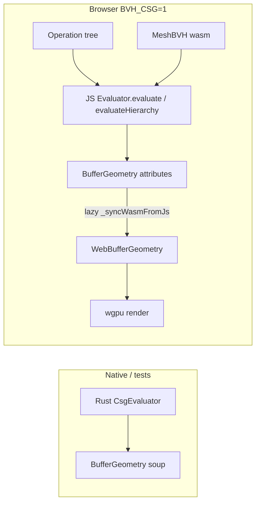

# threers plan

Roadmap and deferred work for the three.js-compatible Rust/wgpu stack (`web/threejs-shim.js` + wasm core).

## Now

- Core parity suite (113 scenes + generated edge cases)
- Post-processing pass parity (halftone + film perfect; glitch/dotscreen/fxaa approximate — see notes below)
- **mesh-bvh v1** — opt-in Cargo/JS feature; 2 flagged parity scenes at 0% pixel diff (see below)
- **mesh-bvh v2** — build strategies, refit, serialize, extended queries, StaticGeometryGenerator; 5 parity scenes at 0% pixel diff; `scripts/ci-mesh-bvh.sh`
- Parity compare UI — orbit controls on all interactive scenes, **Sync orbit** on by default, mesh-bvh scenes in sidebar

**Approximate postfx (SwiftShader parity run)**

| Scene | Diff | Cause |
|-------|------|--------|
| fxaa | ~2.3% | Composer RT path is 0% vs copy; gap is FXAA edge blending. WebGL FXAA applies subtle changes that differ from WGSL f16-linear sampling on half-float RT. |
| dotscreen | ~4% | Composer copy 0%; gap is `average*10 + pattern` amplifying half-float / sin drift. GLSL pattern pre-bake (WebGL2) wired but same threshold on SwiftShader. |
| glitch | ~10.6% | Snow-free parity scene; production snow uses GLSL `sin()` ≠ WGSL. |
- Offline loader deps (draco, meshopt) under `web/deps/`

## Later

### Ecosystem extensions (feature-flagged)

Optional compatibility with popular three.js add-ons, compiled only when enabled so default wasm stays lean.

| Flag | Package | Purpose | Status |
|------|---------|---------|--------|
| `mesh-bvh` | [three-mesh-bvh](https://github.com/gkjohnson/three-mesh-bvh) | BVH-accelerated raycasting, shapecast, GPU picking helpers | **v2 shipped** (core + extended queries) |
| `bvh-csg` | [three-bvh-csg](https://github.com/gkjohnson/three-bvh-csg) | Boolean CSG on `BufferGeometry` (depends on `mesh-bvh`) | **Shipped** — Rust `src/csg/` + JS `web/csg/` (`BVH_CSG=1`) |

**Approach**

- Add Cargo features in `Cargo.toml` (`mesh-bvh`, `bvh-csg`; `bvh-csg` implies `mesh-bvh`).
- Mirror flags in the JS shim build so `threejs-shim.js` can export matching APIs (`MeshBVH`, `StaticGeometryGenerator`, CSG evaluators) without pulling them into the default bundle.
- Implement Rust-side BVH build/query first; wire shim adapters that match three-mesh-bvh call shapes and data layouts.
- **CSG**: Rust `CsgEvaluator` in `src/csg/` for native/tests; browser path loads the JS port under `web/csg/` when `BVH_CSG=1` (wasm BVH used during splits).
- Add parity scenes behind the same flags (raycast-heavy picking, simple CSG union/subtract/intersect, hierarchy) — not part of the default 113-scene run.
- Track API variations across package versions (generator options, `MeshBVH` serialization, CSG attribute handling) and gate breaking differences per flag sub-version if needed.

**Non-goals for v1 of these flags**

- No requirement to ship the full three-mesh-bvh shader/debug visualization suite on day one.
- No default enablement; apps opt in explicitly at build time.

---

### mesh-bvh — v2 (shipped)

Build wasm with BVH support:

```bash
MESH_BVH=1 web/build.sh
```

This enables the Cargo `mesh-bvh` feature **and** flips the JS feature flag (`web/features.js` → `features.meshBvh: true`), wiring `mesh-bvh-addon.js` to the real implementation instead of the stub.

Import the addon in browser apps:

```js
import { isMeshBvhEnabled, installMeshBvh, MeshBVH, StaticGeometryGenerator } from './mesh-bvh-addon.js';
if (!isMeshBvhEnabled()) throw new Error('Rebuild with MESH_BVH=1 web/build.sh');
installMeshBvh(THREE);
geom.boundsTree = new MeshBVH(geom);
```

Verify: `node web/scripts/check-mesh-bvh.mjs` (after `MESH_BVH=1` build).

**Implemented (Rust + wasm + `web/mesh-bvh-impl.js`)**

| API | Notes |
|-----|-------|
| `MeshBVH` constructor | `CENTER` / `AVERAGE` / `SAH`; `offset` / `count` range build |
| `raycast` / `raycastFirst` | Local-space; sorted hits; backface culling (matches three-mesh-bvh) |
| `shapecast` | `NOT_INTERSECTED` / `INTERSECTED` / `CONTAINED`; JS traversal over wasm `nodeBuffer` |
| `getBoundingBox` | Root AABB |
| `refit` | Rebuild leaf bounds after position-only edits |
| `serialize` / `deserialize` | Versioned binary round-trip |
| `intersectsBox` / `intersectsSphere` | BVH overlap queries |
| `closestPointToPoint` | Closest point on mesh surface |
| `computeBoundsTree` / `disposeBoundsTree` | On `BufferGeometry`; invalidates on geometry edits |
| `acceleratedRaycast` | Patches `Mesh.raycast`; respects `firstHitOnly`; uses `matrixWorld` |
| `StaticGeometryGenerator` | World-space bake + `mergeGeometries`; built-in primitives via `toBufferGeometry()` |
| `GenerateMeshBVHWorker` | Async API stub (main-thread yield; no real worker yet) |
| `installMeshBvh(THREE)` | Prototype patches + `Raycaster.intersectObject` |
| `Raycaster` fast path | `bounds_tree` on `BufferGeometry` when feature enabled |

**Parity**

- Manifest: `tests/parity/scenes-manifest-mesh-bvh.json` (5 scenes)
- Runner: `node tests/parity/run-mesh-bvh.js` (requires `MESH_BVH=1 web/build.sh`)
- CI: `scripts/ci-mesh-bvh.sh` (build + `check-mesh-bvh.mjs` + unit tests + parity)
- Results: `tests/parity/out/compare-results-mesh-bvh.json`
- Compare UI: scenes merged into sidebar; `threers-runner` + `threejs-runner` inject orbit controls; mesh-bvh addon loaded when `features.meshBvh`

| Scene | Visual diff | Meta |
|-------|-------------|------|
| `mesh-bvh-raycast` | 0% | `hitCount` + `hitDistance` match |
| `mesh-bvh-shapecast` | 0% | `shapecastHits` match (225) |
| `mesh-bvh-multihit` | 0% | multi-object sorted hits |
| `mesh-bvh-static-gen` | 0% | `StaticGeometryGenerator` merge + raycast |
| `mesh-bvh-intersects` | 0% | `intersectsBox` / `intersectsSphere` |

**Dev footguns**

- Plain `web/build.sh` sets `features.meshBvh: false` — mesh-bvh scenes fail in compare UI until rebuild with `MESH_BVH=1`.
- mesh-bvh parity is **not** in main `node tests/parity/run.js`; run `run-mesh-bvh.js` or `scripts/ci-mesh-bvh.sh`.

---

### mesh-bvh — v3 (deferred, full three-mesh-bvh parity)

Remaining backlog for 100% three-mesh-bvh coverage:

1. **Workers** — real `GenerateMeshBVHWorker` / `ParallelMeshBVHWorker` (Web Worker wasm build)
2. **Extended queries** — `raycastObject3D`, `intersectsGeometry`, `closestPointToGeometry`, `bvhcast`
3. **Other BVH types** — lines, points, skinned, batched / instanced (`ObjectBVH`, batched bounds trees)
4. **GPU / debug** — `BVHShaderGLSL`, WebGPU/TSL compute raycast, `VertexAttributeTexture`, `MeshBVHHelper`
5. **Parity** — `CONTAINED` shapecast edge case; merge mesh-bvh into main `run.js` CI (optional)

---

### bvh-csg (shipped, feature-flagged)

Depends on `mesh-bvh`. Dual stack matching [three-bvh-csg@0.0.16](https://github.com/gkjohnson/three-bvh-csg):

| Stack | Location | Use |
|-------|----------|-----|
| **Rust** | `src/csg/` (`CsgBrush`, `CsgEvaluator`, hierarchy) | Native examples, wasm when feature on, topology unit tests |
| **JS** | `web/csg/` + `bvh-csg-addon.js` | Browser parity scenes / demos when `BVH_CSG=1` |

**Status:** Shipped behind `BVH_CSG=1`. Nine pixel-parity scenes at 0% vs three-bvh-csg@0.0.16. Hierarchy live chain (s1–s4) has **exact ordered TriKey** topology and exact vert counts (72 / 53070 / 55914 / 59454). Interactive demo: `web/examples/bvh-csg-threers.html`.

```bash
BVH_CSG=1 web/build.sh   # enables Cargo bvh-csg (implies mesh-bvh) + features.bvhCsg
cargo test --features bvh-csg --lib csg
cargo run --example bvh_csg_hierarchy --features bvh-csg
```

```js
import { isBvhCsgEnabled, installBvhCsg, Brush, Evaluator, ADDITION } from './bvh-csg-addon.js';
if (!isBvhCsgEnabled()) throw new Error('Rebuild with BVH_CSG=1 web/build.sh');
installBvhCsg(THREE);  // also calls installMeshBvh
```

| API | Status |
|-----|--------|
| `Brush`, `Evaluator`, `ADDITION` / `SUBTRACTION` / `INTERSECTION` / `DIFFERENCE` | Parity-tested (JS + Rust) |
| `Operation`, `OperationGroup`, `evaluateHierarchy` | Parity-tested (hierarchy scene) |
| `HOLLOW_SUBTRACTION` / `HOLLOW_INTERSECTION`, batch `evaluate`, multi-material `useGroups` | Parity-tested (dedicated scenes) |
| `GridMaterial`, debug helpers | Ported, not parity-tested |
| `AsyncEvaluator` (worker) | Stub / not wired |

- Default `web/build.sh` → `features.bvhCsg: false`, `bvh-csg-addon.js` → stub (throws on use).
- `web/csg/index.js` and `bvh-csg-impl.js` guard on `isBvhCsgEnabled()` so direct imports fail when disabled.
- Verify enabled build: `node web/scripts/check-bvh-csg.mjs`
- Verify default stub build: `node web/scripts/check-features-stub.mjs`
- Parity: `node tests/parity/run-bvh-csg.js` · CI: `scripts/ci-bvh-csg.sh`
- Topology gate: `cargo test --features bvh-csg --lib csg::step_tests`
- Compare UI: `tests/parity/compare-ui.html` (loads `scenes-manifest-bvh-csg.json`)

#### Architecture (what runs where)



| Layer | Location | Role |
|-------|----------|------|
| Rust CSG core | `src/csg/` | Boolean ops + hierarchy for native / feature builds |
| JS CSG core | `web/csg/core/` | Browser boolean ops (same algorithms) |
| Hierarchy ops | `Operation` / `CsgOperation` | Scene-graph CSG tree + dirty/caching |
| BVH accel | `mesh_bvh` / `web/mesh-bvh-impl.js` | Used inside CSG triangle tests |
| Geometry bridge | `geometryToBufferGeometry()` in `threejs-shim.js` | Wasm primitives → non-indexed `BufferGeometry` for JS CSG input |
| Draw | wasm `Renderer` | Standard mesh pipeline; **no CSG awareness** at draw time |

**Implication (compare UI):** A “missing hierarchy piece” is almost never “CSG dropped geometry.” Check vertex counts / bbox first, then camera / orbit sync.

#### Hierarchy (`evaluateHierarchy`)

Hierarchy scenes build an `Operation` tree, not a flat `evaluator.evaluate(a, b, op)` chain.

```
root (ADDITION, outer box)
├── cut (SUBTRACTION, inner box)
├── sphere (ADDITION)
└── windowGroup (OperationGroup)     ← groups are NOT boolean operands themselves
    ├── winCut (SUBTRACTION)
    └── winFrame (ADDITION)        ← thin slab (0.12 depth) — angle-sensitive
```

`evaluateHierarchy` (`web/csg/core/Evaluator.js`):

1. `root.updateMatrixWorld(true)` — world matrices for all ops.
2. Post-order `traverse` on `Operation` nodes.
3. `OperationGroup` children are **flattened** via `flatTraverse` (groups pass through; only `Operation` leaves are evaluated).
4. For each dirty `Operation` with changed children: fold children left-to-right with `evaluate(accum, child, child.operation)`.
5. Result cached on `brush._cachedGeometry`; root cache copied to target `Brush`.

`OperationGroup` (`web/csg/core/operations/OperationGroup.js`) is a `Group` marker (`isOperationGroup`) with matrix dirty tracking — it does not hold CSG geometry itself. World transforms on groups (e.g. `windowGroup.position`) apply to child ops before evaluate.

**Parity scene `bvh-csg-hierarchy`:** outer shell − inner cut + sphere + window (cut + frame). Scenes start at **slab-view camera** `(-3.8, 2.9, 1.25)` so the thin `winFrame` is visible on both sides at load (front `(0,0,5)` hides it on neither reference nor threers).

| Check | three.js / JS CSG | threers Rust CSG | threers browser (JS CSG + wasm) |
|-------|-------------------|------------------|----------------------------------|
| Ordered TriKey (hierarchy live) | reference | 100% exact | n/a (JS evaluator) |
| Vert counts s1–s4 | 72 / 53070 / 55914 / 59454 | exact | same JS path |
| Pixel parity @ default camera | — | — | 0% |

#### Compare UI + orbit (hierarchy footguns)

Parity compare uses **static scene iframes** (`scenes/threejs-*.html`, `scenes/threers-*.html`), not extracted runner code. Orbit sync is required for hierarchy because the window frame is thin and view-dependent.

| Component | File | Notes |
|-----------|------|-------|
| Sync bridge | `tests/parity/parity-orbit-sync.js` | `applyOrbitState` / `exportOrbitState`; threers calls `orbit.resetFromCamera()` → `reseedFromCamera` |
| Compare shell | `tests/parity/compare-ui.js` | Continuous rAF mirror from active pane; **Sync orbit** on by default |
| Scene orbit loops | `gen-bvh-csg-scenes.mjs` | `syncPassive`: skip `controls.update()` when sync on and pane not dragged |
| Wasm orbit | `src/controls/orbit.rs` | **Idle frames must not rewrite camera** — external sync sets wasm pose without updating spherical; idle `update()` used to snap back to `(0,0,5)` and show “sphere only” |

**Symptom → cause (hierarchy)**

| What you see | Likely cause |
|--------------|--------------|
| Left shows frame/slab, right does not (different orbit angles) | Camera desync between iframes, not missing CSG |
| Right shows only sphere, block gone | Stale orbit spherical overwriting synced wasm camera (fixed: idle orbit + `syncPassive`) |
| Both sides lack frame at front view | Expected — `winFrame` is edge-on from `(0,0,5)` |
| `triCount` differs (JS vs three.js raw) | Expected for some builds — pixel parity and Rust TriKey tests are the gates |

**Debug hierarchy without compare UI**

`tests/parity/scenes/debug-bvh-csg-hierarchy.html` — side-by-side CSG stats + fixed slab-view camera; proves `winFrameVerts > 0` on both sides before render.

**Gotchas**

- Requires `geometryToBufferGeometry()` for built-in wasm primitives before `Brush` construction.
- three.js reference uses `.toNonIndexed()`; threers must use `geometryToBufferGeometry()` so wasm `BoxGeometry` etc. become equivalent non-indexed soup.
- `new Brush()` as evaluate target needs default `BufferGeometry` on `Mesh` (three.js ctor parity).
- CSG uses JS-side `BufferGeometry` attributes; wasm sync is lazy via `_syncWasmFromJs()` before render/BVH.
- Parity checks **pixels**, not exact `triCount` (internal triangle splits can differ while rendering identically).
- `evaluator.useGroups = false` in parity scenes — multi-material group indices not exercised in hierarchy.
- `evaluateHierarchy` still carries upstream `// TODO: fix` in `Evaluator.js`; behavior matches three-bvh-csg@0.0.16 for parity scenes.
- `bvhcast` reads triangles from geometry `index` + `position` with `resolveTriangleIndex` when `indirect: true`.
- After wasm orbit changes: rebuild `BVH_CSG=1 web/build.sh`; hard-refresh compare UI (`compare-ui.js?v=…`).
